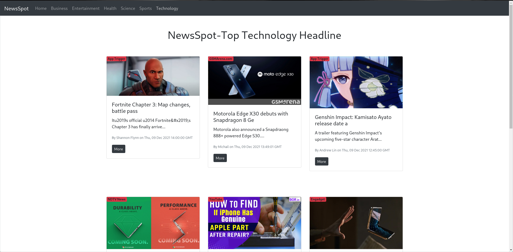

<h1 align="center"> News-App </h1>

News-App is made using ReactJs and also using newsapi.This App provides the latest news for distinct field.


## Required Environment Variables

VARIABLE | Sample value
--- | ---
REACT_APP_API_KEY | Make your own API key from [newsapi](https://newsapi.org/)


## Installation Instructions

* Install *Node.js*
* Install *npm*

* Clone this github repo ```https://github.com/gaurav147-star/News-App.git``` .
* In the local project directory, create a new file called "`.env`".
* Setup the environment variables as described above.
* Open the local project directory in a terminal, and run: `npm install`.
* npm start .


## Application Screenshots



	
